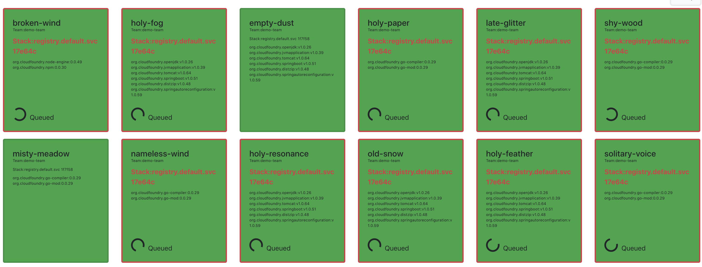

# pbdemo



#### Prerequisites

- Access to a kubernetes cluster with kpack or Build Service Installed
- Cluster-admin permissions for the kubernetes cluster with kpack or Build Service Installed
- Accessible Docker V2 Registry

## Setup

1. Download and install the most recent pbdemo [github release](https://github.com/matthewmcnew/build-service-Visualization/releases)
for your operating system.

1. Start the local server for the build service visualization web UI

    ```bash
    pbdemo visualization
    ```
    
    >  This should start up a local Build Service visualization web server that you access in the browser. 

1. Populate Build Service with sample image configurations.

    The `pbdemo populate` command will relocate builder and run images to a configured registry to enable build service demos.
    In addition, the command will "seed" an specified number of sample build service image configurations. 
    
    Running `pbdemo populate` will look something like this:
    ```bash
    pbdemo populate --registry gcr.io/my-project-name --count 20
    ```
   
    - `registry`: The registry to install build service images & for build service to build new images into. You need local write access to this registry.
    
    - `count`: The number of initial build service image configurations to create.
    
    - (Optional) `cache-size`: The Cache Size for each image's build cache. Example: `--cache-size 100Mi` Default: '500Mi'
    
    >  Warning: The registry configured in pbdemo populate must be publicly readable by build service 
    
1. Navigate to the Web UI in your browser to see build service build all the images created in step #3. 

## Demo: Stack Update

1. Navigate to the build service web UI and mark the current stack (run image) as 'vulnerable'.   

    - Copy the truncated stack digest from from one of the existing images in the visualization.
    - Click on Setup in the top right corner.
    - Paste the stack (run image) Digest into the Modal.
    - Click Save. 
    - You should see the images with that run image highlighted in red.  
     
1. Push an updated stack (Run Image)
    
    The `pbdemo update-stack` will push an updated image to the registry build service is monitoring. 
    
    ```
    pbdemo update-stack
    ```   

1. Navigate to the Web UI in your browser to watch build service `rebase` all the images that used the previous stack (run image).

## Demo: JDK Update via Buildpacks 

1. Navigate to the build service web UI and mark the current `org.cloudfoundry.openjdk` as 'vulnerable'.   

    - Copy the current backpack ID & Version for `org.cloudfoundry.openjdk` from one of the existing images in the visualization.
    - Click on Setup in the top right corner.
    - Paste the Buildpack ID & Version into the Modal.
    - Click Save. 
    - You should see the images that were built with that buildpack highlighted in red.  
     
1. Push an Updated Backpack 
    
    The `pbdemo update-buildpacks` will push an updated builder with updated buildpacks to the registry build service is monitoring.
    
    ```
    pbdemo update-buildpacks
    ```   

1. Navigate to the Web UI in your browser to watch build service `rebuild` all the images that used the previous buildpack.

## Cleanup
   
1. Remove all images created by `pbdemo` with `cleanup`

    ```
    pbdemo cleanup
    ```  
